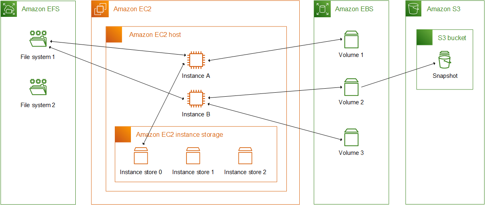
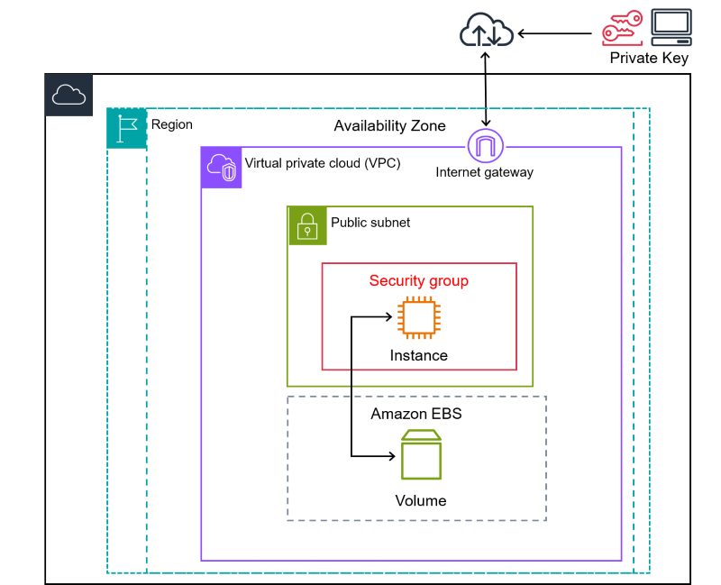

## O que é cloud
- Modelos de Computacao
  - On Premise
  - Hybrid
  - Cloud (or as refered by the exam, Public)
- Vantagens
  - Despesas variaveis & Otimizacao de custos
  - Capacidade & Economia de escalas
  - Rapidez & Agilidade
- Infraestrutura global AWS: Regioes, Zonas de Disponibilidades e Locais de Borda
  - Conformidade com a governanca de dados e requisitos legais
  - Proximidade com clientes
  - Precificacao
  - Servicos disponiveis
- Interagir com servicos
  - Console de gerenciamento
  - AWS CLI
  - SDKs
- Abstraction
  - IaaS
  - PaaS
  - SaaS
- Infrastructure as Code
- Disaster Recovery
  - Recovery Point Objective (RPO)
    - tempo máximo aceitável desde o último ponto de recuperação de dados
  - Recovery Time Objective (RTO)
    - atraso máximo aceitável entre a interrupção do serviço e sua restauração
  - Estratégias
    - Backup and Restore
      - RPO e RTO alto
      - Mantem tudo em backup
      - Mais barato
    - Pilot Light
      - RPO mais baixo e RTO um pouco mais baixo
      - Mantem serviços core ativos (DB, por exemplo)
    - Warm Standby 
      - RTO muito mais baixo
      - Mantem um pedaço de serviços sempre ativos, apenas necessitando de redirecionamento
    - Multi site 
      - Reduz tendendo a zero o RTO e RPO
      - Processamento é executado simultaneamente em várias regiões
      - Mais caro

## Services

### Computing

#### EC2

O Amazon Elastic Compute Cloud (Amazon EC2) oferece uma capacidade de computação escalável sob demanda na Nuvem Amazon Web Services (AWS). O uso do Amazon EC2 reduz os custos de hardware para que você possa desenvolver e implantar aplicações com mais rapidez. É possível usar o Amazon EC2 para executar quantos servidores virtuais forem necessários, configurar a segurança e as redes e gerenciar o armazenamento. Você pode adicionar capacidade (aumentar a escala verticalmente) para lidar com tarefas de computação pesada, como processos mensais ou anuais ou picos no tráfego do site. Quando o uso diminui, você pode reduzir a capacidade (reduzir a escala verticalmente) de novo.

- Raw computing unit
- More control over processing
- Can be used for database
- Can be used for containers

##### Resources

O Amazon EC2 fornece os seguintes recursos de alto nível:

- Instâncias
- Imagens de máquina da Amazon (AMIs)
- Tipos de instância
- Pares de chaves
- Volumes de armazenamento de instâncias (temporarios)
- Volumes do Amazon EBS
- Regiões, zonas de disponibilidade, zonas locais, AWS Outposts e zonas do Wavelength
- Grupos de segurança
- Endereços IP elásticos (estáticos para computação em nuvem dinâmica. Tem cobrança adicional. Especifico para a conta. Associado a qualquer VPC por vez. Pode-se usar NAT para preservar o limite de 5 IPs por regiao)
- Tags
- Nuvens privadas virtuais (VPCs)

##### Instances

###### By Hardware

- Quando executa uma instância, o tipo de instância que você especifica determina o hardware do computador host usado para sua instância
- Cada tipo de instância oferece recursos de computação, memória e armazenamento diferentes, além de ser agrupado em famílias de instâncias de acordo com esses recursos

Convenção de nome:
1. Instance family
   - Instance generation
1. Processor family
1. Additional capability
1. Instance size

https://docs.aws.amazon.com/pt_br/AWSEC2/latest/UserGuide/instance-types.html

###### By Price

- On-Demand
  - pagamento por segundos. Não há compromisso de longo prazo ao comprar Instâncias on-demand
  - você tem pleno controle sobre o ciclo de vida da instância: quando executar, interromper, hibernar, iniciar, reiniciar ou encerrá-la.
  - recomenda-se o uso de Instâncias on-demand para aplicações com workloads de curto prazo e irregulares que não podem ser interrompidas.
- Spot instances
  - are good for short term requirements as they can be very economical. However, you may find that the instance is terminated if the spot market price moves
  - Uma instância spot é uma instância que usa capacidade adicional do EC2 que está disponível por um valor mais baixo que o preço sob demanda
  - As Instâncias spot são uma opção econômica se houver flexibilidade quanto ao momento em que as aplicações serão executadas e se as aplicações poderão ser interrompidas
- Reserved instances
  - are good for long-term, static requirements as you must lock-in for 1 or 3 years in return for a decent discount
  - As instâncias reservadas não são instâncias físicas, mas um desconto na fatura aplicado na sua conta pelo uso de instâncias sob demanda
- Dedicated instances
  - Por padrão, as instâncias EC2 são executadas em hardware de locação compartilhada. As instâncias dedicadas são instâncias EC2 executadas em um hardware dedicado a um único cliente. As instâncias dedicadas que pertencem a diferentes Contas da AWS são isoladas fisicamente em nível de hardware, mesmo que essas contas estejam vinculadas a uma única conta pagante. No entanto, as instâncias dedicadas podem compartilhar o hardware com outras instâncias da mesma Conta da AWS que não sejam instâncias dedicadas.
- Dedicated host
  - Um Host dedicado também é um servidor físico que é dedicado para seu uso. Com um Host dedicado, você tem visibilidade e controle sobre como as instâncias são colocadas no servidor

##### Life Cycle

##### Auto Scaling

Automaticamente provisiona scale out (horizontal) de instancias EC2.

##### Amazon Machine Images

Os modelos pré-configurados para suas instâncias que empacotam os componentes de que você precisa para seu servidor (incluindo o sistema operacional e software adicional).

Uma Imagem de máquina da Amazon (AMI) é uma imagem compatível e mantida pela AWS, que fornece as informações necessárias para iniciar uma instância. Especifique uma AMI ao iniciar uma instância. Uma AMI inclui um ou mais snapshots do Amazon Elastic Block Store (Amazon EBS) ou, para AMIs com suporte de armazenamento de instâncias, um modelo para o volume raiz da instância (por exemplo, um sistema operacional, um servidor da aplicação e aplicações).

É possível criar ou utilizar uma imagem.

##### Storage Diagram

##### Network Diagram

#### Outposts

O AWS Outposts é uma família de soluções totalmente gerenciadas que fornecem infraestrutura e serviços da AWS para praticamente qualquer local da borda ou on-premises. As soluções do Outposts permitem que os clientes estendam e executem serviços da AWS nativos on-premises e estão disponíveis em uma variedade de formatos.

Executa alguns produtos da AWS localmente e se conecta a uma ampla gama de serviços disponíveis na região local da AWS.
Possui Infraestrutura gerenciada.

Casos de uso
- Computação de baixa latência
- Migração e modernização
- Residência de dados
- Processamento local de dados

Options:
- Servers
- Racks

#### Containers
- Elastic Container Registry
  - Manage and store container images
- Elastic Container Service
- Elastic Kubernetes Service

#### Serverless
- Lambda
  - Event based functions (low-code)
- Fargate
  - Automatic managed containers, network and scalling
- Elastic Beanstalk
  - Fully managed deployment, provisioning, load balacing, auto scaling, monitoring and management of web code

#### Others

- Wavelength: Deploy computers in wavelenght zones (5G) for ultra low latency
- Batch: Trabalhos otimizados em lote, para Big Data, Execuções Repetidas (Finance Processing), ou ML, por exemplo

### Storage

#### Simple Storage Service (S3)

Usado para objetos, pode guardar static web sites, assets, disaster recovery e backups.
Its object oriented, different from EFS, that is highly hierarchical. It makes easier for
services like Athena to query objects due this feature.
Capacidade virtualmente ilimitada.

- Composicao
   - Arquivo (Valor)
   - Identificador Exclusivo (Chave)
   - Metadados
- Cross region replication
- Transfer Acceleration
  - para bucket centralizado no mundo todo, ou que transfere altas quantidades
  - Global scope
- Categorias de armazenamento
  - S3 Intelligent Tiering
    - para economia automatica de custos
  - S3 Standard
    - para dados acessados com frequencia
  - S3 Express One Zone
    - para dados acessados com mais frequencia
  - S3 Infrequent Access
    - para dados acessados com menos frequencia
- Backup, Arquivamentos e Recuperacao de Desastres
  - Glacier
    - para grande conjunto de dados
    - nao querer acesso imediato. 1 a 2 vezes por ano, de forma assincrona
  - Glacier Instant Retrieval
  - Glacier Deep Archive
    - retencao maior. De 7 a 10 anos
    - recuperacao em horas
- Storage lifecycle
  - Transition actions
  - Expiration (removal) actions

#### Elastic Block Store (EBS)

- In conjunction with EC2, it works as a hard drive. Data in EBS is stored in equally sized blocks.
- Can be used for snapshots, for example.
- It's very perfomatic, available and easialy backup and restoration
- Has low latency

#### Elastic File System

- In conjunction with EC2, it can be mounted for multiple instances. Its very scalable.

#### Storage Gateway

- Hybrid comuting storage integration
- Uses direct connect encrypted

#### Backup

- https://docs.aws.amazon.com/aws-backup/

### Network
- VPC and Subnets
  - Each VPC exists within a single region and cannot span multiple regions.
  - Within each VPC, you can create one or more subnets.
  - Each subnet is associated with a single Availability Zone and cannot span multiple Availability Zones.
  - Public subnet, Private subnet, VPN-only subnet, and Isolated subnet.
- Elastic Load Balancing
- Direct Connect
  - Conexao direta com a rede AWS
  - Menor gargalo e instabilidade
- Route 53 (DNS)
  - Global scope
- CloudFront
  - Low latency
  - Uses content delivery and edge locations strategy
  - Global scope
- API Gateway

### Segurança e Conformidade

#### Identity and Access Management
The AWS account root user or an administrative user for the account can create IAM identities. An IAM identity provides access to an AWS account. An IAM user group is a collection of IAM users managed as a unit. An IAM identity represents a human user or programmatic workload, and can be authenticated and then authorized to perform actions in AWS. Each IAM identity can be associated with one or more policies. Policies determine what actions a user, role, or member of a user group can perform, on which AWS resources, and under what conditions.
  - Organizations and Accounts
  - Group, Users and Roles
   - MFA
   - Access Portal
  - Policies
  - Global scope

#### ACLs & Security Groups
- ACLs: Firewall for VPC Subnets
- Security Group: Firewall for EC2 Instances

#### Authentication
- Key pairs are used for encrypting logon information when accessing EC2 instances
- Access keys are a combination of an access key ID and a secret access key
- Server certificates are SSL/TLS certificates that you can use to authenticate with AWS services
- Security groups are an instance-level firewall used for controlling access to AWS resources

#### Others

- Cognito
  - Gerenciamento de identidades de aplicacoes. Login, por exemplo
- AWS Artifact
  - Conformidade com regulamentos

##### Threat Detection
- AWS Inspector
  - Analise, com base em boas praticas, dos servicos
- AWS GuardDuty
  - Threat detection using ML

##### Frontline
- AWS WAF
  - Firewall
  - Global scope
- AWS Shield
  - DDoS
  - Global scope

##### Keys and Certificates

- AWS Key Management Service (Chaves criptograficas)
- AWS CloudHSM (Manage Hardware Securit Module encryption keys)
  - Dispositivos Cloud de criptografia, com base em hardware que oferecem funções de gerar e armazenar chaves criptográficas simétricas e assimétricas em infraestruturas de chaves públicas
- AWS Certificate Manager
  - SSL and TLS
  - Global scope

### Outros

#### Application Integration

- EventBridge
  - Bus: Roteador de eventos de uma fonte para um ou mais destinos (lambdas)
  - Pipes: Conexoes de uma fonte para um destino (Lambda)
- SNS (Publisher / Subscriber)
- SQS (Queue)
- SES (Email)
- Step Functions (serviço de orquestração de fluxo de trabalho que facilita a criação e a coordenação de aplicativos distribuídos e baseados em serviços. Ele permite criar fluxos de trabalho visualmente, definindo passos individuais como funções Lambda, tarefas de ECS, atividades de data pipeline, entre outros)

#### Gerenciamento
   - CloudFormation
   - CloudWatch (registro de servicos)
   - CloudTrail (registro de eventos de utilizacao)
   - Config (rastreia alterações em recursos, registra conformidade com políticas e cria snapshots do estado da infraestrutura ao longo do tempo)

#### Developer Tools
   - Cloud9 (IDE)
   - CodeGuru (Find most expensive lines of code)
   - CodeCommit -> CodeBuild (and test) -> CodeDeploy

#### Analytics
- Managed Streaming for Apache Kafka
- Athena: Query S3 data using SQL
- QuickSight: Analise empresarial (Business Intelligence). Entenda os recursos por meio de linguagem natural, e paineis interativos
- Glue: Descubra, prepare e integre todos os seus dados em qualquer escala. Extract, Transform, Load (ETL)

#### Machine Learning
- Transcribe: Automatic speech recognition
- Lex: Build voice and text chatbots
- Comprehend: Processamento de linguagem natural

#### Front-end Web and Mobile
- Farm: Test Android, iOS and Web Apps on real devices in the AWS Cloud, in parallel

## Services: Databases & Migration
- RDS
  - Relational Database
  - Scale Up: More resources
  - Scale Out: Read and Write Replicas
  - RDS Proxy (Manages the scalling)
- Aurora
  - Fully managed
  - apenas MySQL e PostgreSQL
- DynamoDB
- ElastiCache (uses Redis... for caching)
- Data Migration Service (DMS)
- Neptune (graphs)

## Marketplace

Discover, deploy and manage software that runs in AWS (used for data, for example)

### Services
- OpenSearch: Pesquise, Visualize e Analise ate petabytes de texto e dados nao estruturados
- Data Exchange: Encontre, Assine e Use dados de terceiros na nuvem

## Pricing

Three fundamental drivers of cost
   - Compute
     - by hour or second that started until it terminated, unless you have made a reservation
   - Storage
     - by GB
   - Outbound Data Transfer (between AWS and Internet, or between Regions)
     - the more data you transfer, the less you pay

How do you pay?
   - Usage, or Pay less using more
   - Save reserving

Services
   - Total Cost of Ownership calculator
   - Cost Explorer (Visualize, Understand and Manage costs)

## Suporte

### Well Architected Tool
- Pilares: excelência operacional, segurança, confiabilidade, eficiência de performance, otimização de custos e sustentabilidade (CEOS ES)
- "Teste de Personalidade do Projeto"

### Responsabilidade Compartilhada
- AWS: Infraestrutura de Serviços e Segurança Física
- Cliente: Criptografia, Proteção de Tráfego, Configuração de SOs, Redes e Firewalls, Plataformas, Apps, IAM e Dados

### Trusted Advisor
- Economizar dinheiro, melhorar a perfomance e ajudar a corrigir falhar de seguranca
- Security, Performance, Service limits, Cost optimization, Fault tolerance (SCSPF)

### Planos
- Developer, Business, Enterprise on Ramp, Enterprise

### Amazon IQ
- Permite que os clientes encontrem, colaborem com segurança e paguem especialistas terceirizados certificados pela AWS para trabalhos sob demanda em um projeto

### Health Dashboard

- Personal Health
- Service Health
